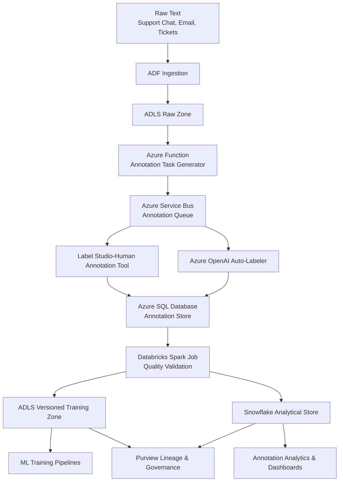

# Text Annotation Pipeline – System Design Document  

---

## 1. Introduction

This document presents the end-to-end architecture for a scalable annotation processing pipeline that generates clean, high-quality training datasets for machine learning. The system supports both human annotators and automated LLM-based annotators, integrates with enterprise governance controls, and enables reproducible dataset versioning.

A lightweight Python script (`process_annotations.py`) is included as a Proof of Concept (PoC) that implements the core quality-validation logic. In production, this logic runs as a distributed Spark job in Azure Databricks.

---

## 2. Objectives & Functional Requirements

### 2.1 Business Objectives
- Produce consistent, reliable, model-ready training datasets.
- Improve efficiency and quality of annotation workflows.
- Ensure governance, reproducibility, and auditability.
- Support hybrid annotation (human + automated/LLM).

### 2.2 Functional Requirements
- Ingest raw text from enterprise systems.
- Generate annotation tasks.
- Store annotation events and metadata.
- Apply quality checks:
  - **QC1:** Confidence threshold
  - **QC2:** Annotator agreement
- Log disagreements for review.
- Produce versioned training datasets in JSONL format.
- Provide lineage and governance visibility.

### 2.3 Non-Functional Requirements
- Scalability (millions of annotations).
- Idempotent pipeline runs.
- Secure service-to-service communication.
- Observability and audit trail.
- Cloud-native components.

---

## 3. High-Level System Architecture

This architecture represents the complete path from ingestion to annotation, validation, dataset generation, and ML training.



---

## 4. Detailed Component Architecture

### 4.1 Ingestion Layer – Azure Data Factory (ADF)

* Moves raw text into ADLS.
* Triggers annotation task generation.
* Orchestrates Databricks quality jobs.
* Provides operational observability.

---

### 4.2 Storage Layer – Azure Data Lake Storage (ADLS)

Stores:

* Raw text (landing/bronze)
* Annotation snapshots
* Final versioned training datasets

Structure example:

```
/raw/text/2025-12-03/
/annotations/snapshots/2025-12-04/
/training_data/version=2025-12-04_1200/
```

---

### 4.3 Azure Function-Annotation Task Generation

* Implemented as a scheduled Azure Function that reads new raw text files from the ADLS Raw Zone.
* Converts each record into a structured annotation task payload.
* Publishes one message per text into Azure Service Bus (annotation queue) for human and/or LLM annotators to consume.

Supports **both**:

* Human annotation platforms
* Automated LLM annotation services

---

### 4.4 Annotation Layer – Human & Automated Annotators

This layer consists of two types of annotation workers that consume tasks from Azure Service Bus:

1. Human Annotation Tool (e.g., Label Studio)
A human-in-the-loop annotation platform that allows annotators to review text samples, assign labels, and record metadata such as annotator ID, timestamp, and confidence (if applicable).
The tool integrates with Azure Service Bus for task intake and writes completed annotation records to Azure SQL Database via API or connector.

2. Azure OpenAI Auto-Labeler
An automated annotation service that uses Azure OpenAI models to generate initial labels for selected text samples.
The service acts as a queue worker: it reads annotation tasks from Service Bus, applies the configured LLM labeling logic, and writes annotations with confidence scores into Azure SQL Database.
Low-confidence predictions can be routed back for human verification, supporting an active-learning loop.

Together, these workers form a hybrid annotation system that balances speed (LLMs) and accuracy (human annotators), improving throughput while maintaining high data quality.

---

### 4.5 Annotation Store – Azure SQL Database

Stores every annotation event:

```
text_id
annotator_id
label
confidence_score
annotation_timestamp
```

Benefits:

* Full historical log
* Drift analysis
* Annotator performance metrics
* Perfect match for PoC input schema

---

### 4.6 Processing Layer – Databricks Spark Quality Validation

This is the **production equivalent** of the PoC.

#### Processing Steps:

1. Load annotation rows from Azure SQL.
2. **QC1 – Confidence Filter:** remove annotations below threshold.
3. **QC2 – Agreement Check:** detect conflicts among high-confidence annotators.
4. Generate:

   * Clean training dataset for ML (JSONL/Parquet)
   * Disagreement dataset for human QA
5. Write outputs to ADLS and Snowflake.
6. Register lineage in Purview.

The PoC implements steps 2–4 locally using Python.

---

### 4.7 Analytics Layer – Snowflake

Used to:

* Explore annotation quality
* Track disagreement trends
* Monitor annotator performance
* Build annotation dashboards for product teams

Snowflake complements ADLS by providing high-performance SQL analytics.

---
### 4.8 ADLS – Versioned Training Zone

This ADLS area stores the final, clean training datasets produced by the Databricks quality-validation job.

- Each run of the quality pipeline writes to a new, immutable **dataset version** path, for example:  
  `/training_data/version=2025-12-05_1200/`
- Data is stored in JSONL or Parquet format, partitioned by dataset_version and/or date, making it efficient for downstream ML workloads.
- The versioned layout ensures:
  - Reproducible model training.
  - Easy rollback to previous datasets.
  - Safe experimentation with new annotation guidelines or confidence thresholds.

ML training pipelines, analytics jobs, and future feature-store exports all treat this zone as the **source of truth for curated labels**.

---
### 4.9 ML Training Pipelines

ML training pipelines consume curated datasets from the ADLS Versioned Training Zone.

- Use the latest or a pinned `dataset_version` as input.
- Perform standard steps such as:
  - Train/validation/test splits.
  - Tokenisation or feature engineering.
  - Model training and evaluation.
- Can be implemented in Databricks, Azure ML, or other ML platforms, but all rely on the same versioned dataset contract from ADLS.

By always reading from explicit dataset versions, these pipelines maintain **point-in-time correctness**, enable consistent experiment tracking, and avoid training/serving skew when new dataset versions are created.

---
### 4.10 Governance Layer – Microsoft Purview

Purview captures:

* Lineage from ingestion → annotation → Databricks → ADLS/Snowflake
* Schema evolution tracking
* Data classifications (PII)
* Dataset version certification

This ensures auditability and compliance.

---

## 5. End-to-End Data Flow

This section describes how data moves through the system from raw text to model-ready training datasets and ML pipelines.

### Step 1 – Raw Text Ingestion

- Raw customer text (support chat, email, tickets, etc.) is ingested from upstream systems.
- Azure Data Factory (ADF) transports this text into **ADLS Raw Zone**, typically as CSV/JSON files partitioned by date and source.

### Step 2 – Task Generation and Queueing

- A scheduled **Azure Function – Annotation Task Generator** reads new raw text files from the ADLS Raw Zone.
- For each text record, it builds a structured annotation task payload (e.g., `text_id`, `text`, `source`, `event_time`, `task_type`).
- The function publishes one message per text into **Azure Service Bus – Annotation Queue**.

### Step 3 – Annotation Execution (Human + LLM)

- The **Human Annotation Tool (Label Studio)** and the **Azure OpenAI Auto Labeler** both act as queue workers:
  - They pull tasks from the Annotation Queue.
  - For each task, they assign a label and (where applicable) a confidence score.
- Completed annotation events include: `text_id`, `label`, `annotator_id`, `confidence_score`, and `annotation_timestamp`.

### Step 4 – Annotation Storage

- Both human and automated annotators write their annotation events into **Azure SQL Database – Annotation Store**.
- Azure SQL keeps the full history of annotations for each text, enabling:
  - Drift analysis
  - Annotator quality monitoring
  - Reprocessing/backfills if guidelines change

### Step 5 – Quality Validation and Dataset Building

- A scheduled **Databricks Spark Job – Quality Validation** reads annotation events from Azure SQL.
- It applies:
  - **Quality Check 1 (Confidence Filter):** drops annotations below the configured threshold (e.g., 0.8).
  - **Quality Check 2 (Agreement Check):** groups annotations by `text_id` and:
    - If all high-confidence annotators agree on the label → the sample is accepted.
    - If there is disagreement → the sample is logged for review.
- The job produces two logical outputs:
  - A set of **clean, agreed-upon `{text, label}` pairs**.
  - A **disagreements set** for further QA or guideline refinement.

### Step 6 – Publishing Versioned Training Data

- The Databricks job writes the clean training data into **ADLS – Versioned Training Zone**.
- Each run writes to a new, immutable `dataset_version` path, for example:
  - `/training_data/version=2025-12-05_1200/`
- This layout:
  - Guarantees reproducibility for model training.
  - Prevents accidental overwrites.
  - Supports side-by-side comparison of different dataset versions (e.g., new thresholds or guidelines).

### Step 7 – Analytics and Monitoring

- The same Databricks job (or a follow-up job) aggregates annotation metrics and loads them into **Snowflake – Analytical Store**.
- Snowflake tables back:
  - Label distribution analysis
  - Disagreement trend monitoring
  - Annotator performance dashboards
- Product and data teams can use BI tools (e.g., dashboards) without touching raw or training datasets directly.

### Step 8 – Model Training Pipelines

- **ML Training Pipelines** (running in Databricks, Azure ML, or another ML platform) read from the **ADLS Versioned Training Zone**.
- They select a specific `dataset_version` (e.g., latest or pinned) as input and then:
  - Perform train/validation/test splits.
  - Apply tokenisation or feature engineering.
  - Train and evaluate models for the target task (e.g., intent classification).
- Because pipelines always reference explicit dataset versions, experiments are:
  - Reproducible.
  - Comparable across time.
  - Safe from accidental data drift caused by silent changes.

### Step 9 – Governance and Lineage

- **Microsoft Purview** captures lineage from:
  - Raw text in ADLS Raw Zone,
  - Through annotation events in Azure SQL,
  - Through Databricks processing,
  - To the curated datasets in ADLS Versioned Training Zone and analytical tables in Snowflake.
- Purview, together with naming conventions and versioned paths, enables:
  - Traceability of every training dataset back to its raw sources and annotation events.
  - Compliance reporting and auditability.
  - Clear ownership and certification of “gold” training datasets.


---

## 6. Versioning Strategy

Versioning is critical for ML systems. This pipeline applies **three types of versioning**:

---

### 6.1 **Dataset Versioning**

Each Databricks quality-validation run produces a **new immutable version** of the training dataset.

Example folder structure:

```
/training_data/version=2025-12-04_1200/
/training_data/version=2025-12-05_0900/
```

### Why this matters:

* Reproducible model training
* Ability to roll back to prior datasets
* Safe experimentation
* Multi-team ML collaboration

### How versions are created:

* Timestamp-based or run_id-based folders
* No overwriting of previous versions
* Each version tied to:

  * Code commit
  * Annotation snapshot ID
  * Confidence threshold used
  * Agreement logic version

This makes training datasets **fully traceable**.

---

### 6.2 Annotation Versioning

Azure SQL retains the **full history** of annotation events:

* Original labels
* Human corrections
* LLM-provided suggestions
* Timestamped confidence updates

This enables:

* Drift detection
* Annotator reliability scoring
* Reprocessing historical annotations for new models

---

### 6.3 Pipeline Versioning

Databricks notebooks and Python scripts are source-controlled in Git.
Each dataset version can be traced back to:

* Code version
* Config version
* Annotation batch version

This closes the loop for ML reproducibility.

---
## 7. Feature Store Design, Point-in-Time Correctness & Backfill Strategy

Although the PoC focuses on annotation quality logic, the production design also supports feature engineering and feature-store-style usage for ML models.

### 7.1 Feature Store Design (Offline / Analytical)

In this architecture, the primary “feature store” for offline workflows is implemented using:

- **ADLS** – as the canonical store of versioned training datasets (JSONL/Parquet).
- **Snowflake** – as an analytical store that exposes curated, feature-like tables for ML and analytics teams.

Example Snowflake table:

```text
training_features_intent_classification
(
    entity_id           STRING,      -- e.g. customer_id or conversation_id
    text_id             STRING,
    event_time          TIMESTAMP,
    label               STRING,
    feature_version     STRING,
    dataset_version     STRING,
    ingestion_time      TIMESTAMP
)
```
### 7.2 Point-in-Time Correctness

To avoid label leakage and to ensure realistic model evaluation, the pipeline enforces point-in-time correctness:

- Each annotation event carries an annotation_timestamp (or source event_time).

- When constructing training datasets, features and labels are joined as of that timestamp, using only data with event_time <= annotation_timestamp.

- Late-arriving annotations or updates are handled by generating a new dataset_version rather than mutating existing versions.

For Snowflake-based analytical views, windowed queries (e.g., QUALIFY ROW_NUMBER() OVER (PARTITION BY text_id ORDER BY event_time DESC) = 1) can be used to ensure that only the latest valid feature values as of the label time are included.

This approach guarantees that:

- Training does not “peek into the future”.

- Re-training on historical data faithfully simulates production conditions.

### 7.3 Online/Offline Consistency

To minimise training/serving skew, the same transformation logic is reused across:

- Offline pipelines (Databricks jobs writing to ADLS + Snowflake).

- Potential online pipelines (streaming or micro-batch jobs populating online stores).

Key techniques:

- Shared code modules (e.g., Python/Scala libraries) for feature definitions, imported into Databricks jobs used for both offline batch and online updates.

- A single, centralised definition of label taxonomies and feature semantics (stored in configuration / metadata).

- Using Snowflake/ADLS as the source of truth for both experimentation and backfill of any online stores.

- Although the PoC is purely offline, the design ensures that the same business rules and quality checks apply consistently in both offline and future online serving contexts.

### 7.4 Backfill Strategy

The pipeline supports controlled backfills for scenarios such as:

- Introduction of new label taxonomies.

- Changes to confidence thresholds (e.g., from 0.8 to 0.85).

- Fixes to annotation guidelines or quality logic.

- Onboarding a new source system with historical text.

Backfill is handled by:

- Parameterising the Databricks quality-validation job with a date range or watermark (e.g., start_date, end_date).

- Reading the relevant subset of annotation events from Azure SQL.

- Reapplying the latest QC logic (confidence + agreement).

- Writing outputs into new dataset_version folders in ADLS, without overwriting historical versions.

- Optionally re-populating Snowflake tables with consistent dataset_version tags.

Because the pipeline is idempotent and versioned:

- Backfills do not corrupt existing datasets.

- Old models can continue to reference older versions.

- New models can safely adopt the newly backfilled versions.

## 8. PoC Alignment to Production System

The PoC (`process_annotations.py`) implements the *core logic* of the Databricks job:

| PoC Python Script           | Databricks Production Job               |
| --------------------------- | --------------------------------------- |
| Reads `raw_annotations.csv` | Reads Azure SQL table                   |
| Filters low-confidence rows | Spark filter transformations            |
| Groups by text              | Spark DataFrame groupBy                 |
| Detects disagreements       | Distributed validation                  |
| Writes JSONL                | Writes Parquet/JSONL to ADLS            |
| Writes `disagreements.log`  | Writes review table + Snowflake metrics |

### Purpose of PoC:

* Provide a minimal, clear demonstration of quality logic
* Validate the correctness of QC1 + QC2 rules
* Enable easy local execution for evaluators
* Show how the same logic scales to Spark

---

## 9. Security, Governance & Compliance

### 9.1 Security

* Azure AD authentication for all services
* RBAC for ADF, Databricks, SQL, ADLS, Snowflake
* Private endpoints for SQL + Databricks + ADLS
* Managed Identities (no secrets in code)
* Data encrypted at rest & in transit
* PII redaction prior to annotation
* Restricted access to annotator identity fields

---

### 9.2 Governance

* Purview lineage shows the full data path
* Classification of sensitive fields
* Tracking schema evolution over annotation lifecycle
* Dataset certification (gold/silver tiers)
* Annotator activity audit logs
* Version tags for training datasets

---
## 10. Technology Justification

- **Azure Data Factory (Ingestion & Orchestration)**  
  Used for its native integration with ADLS, SQL, Databricks, and scheduling/monitoring capabilities. It simplifies wiring together ingestion, task generation, and the Databricks quality job with built-in retry and observability.

- **Azure Data Lake Storage (Raw & Training Data)**  
  Chosen as the primary data lake for raw text and versioned training datasets due to its low-cost, scalable object storage, native integration with Databricks and Purview, and support for partitioned Parquet/JSONL layouts.

- **Human Annotation Tool (Label Studio)**  
  Chosen for its flexible UI, easy integration with Service Bus, support for custom labeling workflows, and ability to export structured annotation events. It provides high-quality human-labeled data needed for model evaluation and correction of low-confidence automated labels.

- **Azure OpenAI Auto-Labeler**  
  Selected as the automated labeling component due to its ability to quickly generate labels at scale, reduce human workload, and provide confidence scores used by the quality pipeline. Integrated as a queue worker, it supports hybrid pipelines and active-learning loops.

- **Azure Service Bus (Annotation Queue)**  
  Selected as the message bus for annotation tasks as it provides durable messaging, dead-letter queues, retry support, and decoupling between task generation and annotation workers (human tools or LLM services).

- **Azure SQL Database (Annotation Store)**  
  Used as the annotation event store for its transactional guarantees, relational querying, indexing, and ease of managing historical annotation records with strong consistency.

- **Azure Databricks (Quality Validator & Dataset Generator)**  
  Chosen to run the quality-validation and dataset-building logic at scale. It provides a managed Spark environment, supports both batch and streaming, and integrates tightly with ADLS, ADF, and Purview.

- **Snowflake (Analytical / Feature Store Layer)**  
  Included to provide a cloud-agnostic analytical store for annotation metrics, label distributions, disagreement trends, and feature-like tables used by ML and analytics teams. It complements ADLS by enabling high-performance SQL analytics and BI integration.

- **Microsoft Purview (Governance & Lineage)**  
  Used to capture end-to-end lineage from ingestion through annotation, Databricks processing, and training dataset publication, as well as to manage data classifications and compliance.

- **JSONL for Final Training Output**  
  JSON Lines is chosen as the final dataset format because it is widely used in ML workflows, easily streamable, and simple to version and diff in ADLS. Each record is self-contained and directly consumable by tokenisation/training pipelines.
  
----

## 10. Conclusion

This design provides a scalable, governed, and production-ready approach to building high-quality ML datasets from raw annotated text.
The PoC script demonstrates the core validation logic that the Databricks Spark job would execute at enterprise scale.

This architecture aligns fully with modern ML data engineering practices and the expectations outlined in the Senior Data Engineer assessment.

```


